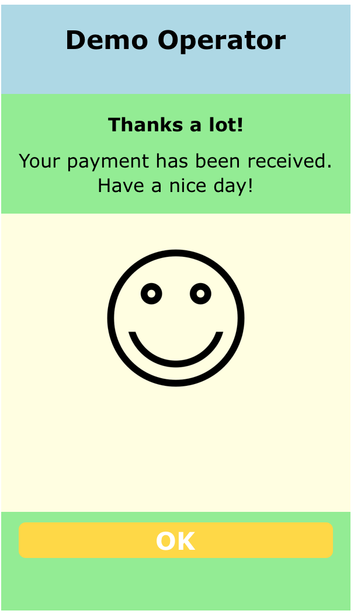
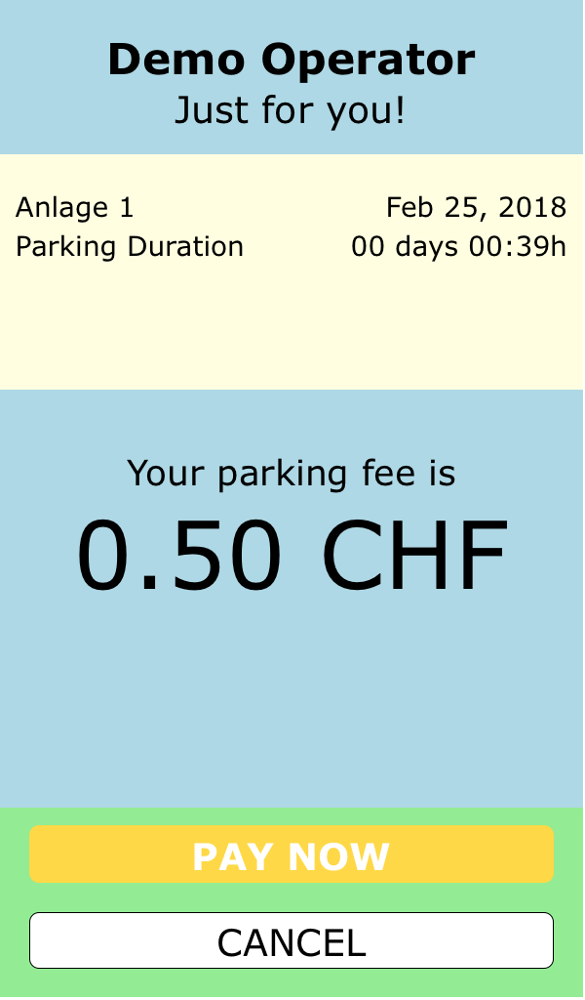

# Scheidt & Bachmann _entervoCheckoutPlugin_
## _Android Version_

## Sample Project

This documentation provides a complete step-by-step tuturial on how to create your first application with the _entervoCheckoutPlugin_ embedded. If you can't wait to kickstart however, you can also download a (simple) sample project right here and get started this way.


* check out the <a href="https://github.com/Scheidt-BachmannDeveloperSK/entervoCheckoutPlugin-Android-Braintree/tree/master/examples/CheckoutDemoBraintree">Sample Project</a>


---

## .aar library

The _entervoCheckoutPlugin_ is provisioned as a so-called _Android Library_. An Android library is essentially a .jar file that - besides code - may also contain resources. Android libraries are using the .aar extension, so is _entervoCheckoutPlugin_. All you have to do is adding this library to your app project, and you're good to go.

## Getting started

If you're using _Android Studio_, adding _entervoCheckoutPlugin_ to your app project is simple. All you have to do, is adding it as a dependency to your app's build.gradle file.

```bash
implementation project(':entervocheckoutplugin')
```

Now, your first application is ready to use the _entervoCheckoutPlugin_ plugin.


The demo app that comes with the plugin is an excellent starting point to explore how the plugin works and how you can customize it to blend in with the design of your own mobile application. In the following section, we will take a closer look at selected parts of this demo application.

# API Users Guide

## Plugin Initialization

Before you can use the plugin, you will have to create an instance of it. The plugin's constructor expects you to pass in the api key that was provided to you by Scheidt & Bachmann. So, instantiating the plugin will look something like this:

```java
SBCheckOut plugin = SBCheckOut.newInstance( "THE-API-KEY-PROVIDED-TO-YOU", Environment.SANDBOX);
```
The plugin has been implemented as an Android _Fragment_ which can be easily embedded in your app's GUI. As it is discouraged by Google to provide _Fragment_ s with non-standard constructors, a new instance is obtained using the static helper function _newInstance()_ . Note: you might want to take a look at the demo app to see it at work.

You might have noticed that there is a second parameter to the _newInstance()_ method. It lets you point the plugin to either a *SANDBOX* environment (you will be using this in the beginning to prepare your app) or the final production system. In this case, you will use _Environment.LIVE_ instead of _Environment.SANDBOX_ .

By default, the _entervoCheckoutPlugin_ plugin comes with built-in support for _Braintree_ as the PSP (payment service provider). As a result, you will be able to offer payment via both, _PayPal_ and credit cards. As an alternative, you can use a different payment engine (to be implemented and provided by you). Please see the separate section 'Payment Services' for further details.

## Preparing Plugin Use

The plugin is just a guest inside your application. We have done everything to make this as unintrusive as possible. Obviously, there needs to be a mechanism via which the _entervoCheckoutPlugin_ pluging and your application can communicate. For the _Android_ operating system, this has been defined in form of an interface that you need to implement. You will typically base the _entervoCheckoutPlugin_ plugin off of an _Activity_ of your own. This _Activity_ will have to conform to the plugin's interface, the _SBCheckOutDelegate_ interface. So, your _Activity_ will look like this:

```java

public class MainActivity extends AppCompatActivity implements SBCheckOutDelegate {

    // ... your source code

}
```

The _SBCheckOutDelegate_ interface requires you to implement four methods via which communication between your application and the plugin is handled:

```java
public interface SBCheckOutDelegate {
	public void onMessage( LogLevel level, String message);
	public void onError( String message);
	public void onStatus( SBCheckOutStatus newStatus, SBCheckOutTransaction info);
}
```

The use of the three methods is basically self-explanatory, but we'll quickly go over them.

### _onError( String message)_

This function is used as a call-back to let your application know that something didn't work. Under normal conditions, the plugin is trying to handle all upcoming issues itself and not bother the hosting application. There are however a few situations where the plugin will have to let you know that an action failed. The most popular examples for this are

* the hosting application (i.e. your app) is trying to start a checkout flow without a proper prior initialization of the plugin
* the hosting application is trying to start a checkout flow while the previously started flow hasn't been completed yet
* the hosting application has requested to cancel the current flow, but this is not possible due to the current state of the plugin flow

The _message_ parameter provides some explanatory text about the error condition.

### _onMessage( SBCheckOut.LogLevel level, String message)_

As indicated before, the plugin is just a guest inside your application. So, it shouldn't bloat the console with log output that you might not want to be visible. For this purpose, the _SBCheckOutDelegate_ interface requires you to implement a call-back function _onMessage_ that is used to route log messages to you. You (your application code) can then decide what to do with it. The plugin differentiates a number of log levels. They are defined by the plugin's _LogLevel_ enum. Available log levels are:

* LogLevel.OFF
* LogLevel.ERROR
* LogLevel.INFO
* LogLevel.TRACE

Using the plugin's _setLogLevel( LogLevel level )_ method, you can set the log level at any time. Initially, it might be interesting for you to activate the _LogLevel.TRACE_ level which constitutes the highest level of verbosity. Later on, you will most likely then set the plugin's log level to either _LogLevel.OFF_ or _LogLevel.ERROR_.

### _onStatus( SBCheckOutStatus newStatus, SBCheckOutTransaction transactionInfo)_

Even though the plugin automatically handles the complete flow from start to end, it might be interesting for your application to know what's going on and perhaps adjust user interface elements not controlled by the plugin. For this purpose, the plugin interface defines the _onStatus_ method. Whenever the plugin flow status changes, this function is called to let you know. The following table provides a list of all possible status codes and a description of what they stand for.
<table cellpadding="5">
<tr><td>INVALID</td><td>an attempt was made to initialize the plugin, but it failed (most likely due to an invalid api key)</td></tr>
<tr><td>UNINITIALIZED</td><td>the plugin was not yet initialized </td></tr>
<tr><td>IDLE</td><td>plugin is idle (i.e. successfully initialized, ready to start) </td></tr>
<tr><td>FLOW_STARTED</td><td>a new flow has been started</td></tr>
<tr><td>CLASSIFICATION_STARTED</td><td>the plugin has initiated an id classification (e.g. rate calculation for a barcode ticket), and the response is pending</td></tr>
<tr><td>CLASSIFICATION_FINISHED</td><td>the plugin received a response to its previous tariff calculation request</td></tr>
<tr><td>PRICE_DISPLAY_STARTED</td><td>the plugin launched the webview presenting the price to the app user</td></tr>
<tr><td>PRICE_DISPLAY_CANCELLED</td><td>the user saw the price information and hit the CANCEL button in the webview</td></tr>
<tr><td>PREPARATION_STARTED</td><td>the user saw the price information and hit the PAY NOW button; the plugin will now do some prep work for the payment</td></tr>
<tr><td>PREPARATION_FINISHED</td><td>payment preparation by the plugin has been completed</td></tr>
<tr><td>PAYMENT_STARTED</td><td>control has been passed on to the payment service provider (plugin is waiting for outcome of this)</td></tr>
<tr><td>PAYMENT_CANCELLED</td><td>payment was cancelled by the user inside the psp controlled GUI</td></tr>
<tr><td>PAYMENT_FINISHED</td><td>psp specific payment flow is completed (can be success or failure)</td></tr>
<tr><td>STATUS_DISPLAY_STARTED</td><td>the plugin launched the webview informing the user about the result of the payment attempt</td></tr>
<tr><td>STATUS_DISPLAY_FINISHED</td><td>the user hit the OK button in the status view</td></tr>
<tr><td>FLOW_FINISHED</td><td>the plugin has completed a flow and will go back to idle mode now</td></tr>
</table>

As indicated earlier, the plugin will handle the complete flow. So, in an ideal situation, all you have to do is to wait for a call to your _onStatus_ delegate function with a _newStatus_ of *SBCheckOutStatus.FLOW_FINISHED* .

The second parameter to _onStatus_, _transactionInfo_, will only be populated in case of selected status changes, in particular *CLASSIFICATION_FINISHED* and *PAYMENT_FINISHED*. In those instances, it will be holding a struct with information about the current/last transaction (of type _SBCheckOutTransaction_). The object looks like this:

```java
public class SBCheckOutTransaction {

    // components available once calculation has been completed
    public Double getAmount();
    public String getDuration();
    public String getFacility_name();
    public int getFacility_id();
    public String getOperator_id();

    // additional attributes once payment has been posted
    public String getUnique_pay_id();
}
```

These are the attributes that you should use to compile the receipt for your application users. The *unique_pay_id* is a reference that the parking operator will be able to use to finda particular payment in the entervo parking system.
The _duration_ string is provided in the format _DD-HH-MM_, so a value of "01-03-17" will stand for a parking duration of 1 day, 3 hours and 17 minutes.

## Starting a Checkout Flow

It is the responsibility of your mobile application to obtain an identification from the app user that stands for his current parking process. Currently, there are three different types of identification that the _entervoCheckoutPlugin_ plugin can handle (obviously, depending on the capabilities of the connected parking system):

identification type | description
------------------- | -----------
SBCheckOut.IdentificationType.BARCODE | a barcode scanned from the ticket that the driver pulled upon entering the garage
SBCheckOut.IdentificationType.LICENSEPLATE | the licenseplate number of the vehicle used to enter the garage (captured by the carpark's camera system)
SBCheckOut.IdentificationType.MOBILEID | a (typically 6-digit) number printed on a ticket; used for non-barcode tickets

A checkout flow is started by invoking the plugin's _start( )_ method. It expects two parameters: the identification and a hint to what type of identification it is. This is really supposed to be a 'hint' only, as most of the time, the plugin and its backing gateway server will automatically discover the correct identification type. So, launching the checkout flow in your _Activity_ will be like this:

```java
// user clicked the "GO!" button
@Override
public void onClick( View view) {

		plugin.start( "9873294792347", IdentificationType.BARCODE);

}
```


Once the _start()_ function has been called, the checkout flow will begin its work. Once the checkout flow has been completed, you can expect a call to your _onStatus()_ delegate function with a _newStatus_ of *SBCheckOutStatatus.FLOW_FINISHED*. This is when your application takes back control.

## Customizing the Appearance

Technically, the plugin uses an _Android_ _WebView_ to display its part of the GUI (the screen to display the price and the screen to show the result of the flow). In order to have a reasonable level of guaranteed flow stability, there are some things that you simply have to use 'as is' and cannot manipulate:

* the logic of the checkout flow itself
* the type of information being displayed

You can however adjust the outer appearance by means of

* providing your own images to replace to plugin's built-in graphics
* overwriting the plugin's built-in CSS (cascaded style sheet) based styling

This allows you to harmonize the plugin's appearance with the overall design of your own application. The demo application that comes with the _entervoCheckoutPlugin_ plugin, contains some examples for plugin customization. The plugin asset override is done using the plugin's _setAsset_ functions:

asset function           | usage
------------------------ | -----
setAsset( Drawable asset, AssetType assetType) |this function can be used to provide an image of your own to replace the plugin's built-in equivalent. Applies to the following asset types: .IMAGE_SUCCESS, .IMAGE_FAIL, .IMAGE_BACKGROUND
setAsset( String contents, AssetType assetType) |this function is used to replace a text-based plugin asset (currently, this only applies to the stylesheeet, i.e. asset type .STYLESHEET)

The _entervoCheckoutPlugin_ plugin's _AssetType_ enum defines the types of assets that you can manipulate:

asset type | description
---------- | -----------
STYLESHEET |the stylesheet; please note that you cannot just provide an incremental update to the existing stylesheet; your own stylesheet must be comprehensive
IMAGE_SUCCESS |the image displayed on the status screen in case the operation was successful (default: happy smiley)
IMAGE_FAIL | the image displayed on the status screen in case the operation failed (default: sad smiley)
IMAGE_BACKGROUND |an optional background image (default: none)

The plugin controls the display of two different types of screens:

* The __price display__
* A __notification screen__ displaying relevant information, asking form confirmation


### Notification Screen

Below, you see a colored version of the confirmation screen to show its break-down into areas/zones. Those areas can be styled by you in terms of height, colors, font, and size (of the icon).



The following table lists the various div id's and class names that you can use for this purpose:
<table cellpadding="5">
<tr><th width="20%">div/class</th><th width="40%">description</th><th width="40%">standard style</th></tr>
<tr>
	<td>#title_area</td>
	<td>the title area (marked light-blue in the picture)</td>
	<td>transparent background, height: 15% of the screen</td>
</tr>
<tr>
	<td>.title_text</td>
	<td>a text element inside the _title_area_ displaying the operator name coming from the plugin configuration</td>
	<td>centered, bold text in size 1.4em</td>
</tr>
<tr>
	<td>#message_area</td>
	<td>the area within which the notification title and message will be displayed (the upper, light-green area in the picture)</td>
	<td>transparent background, height: 20% of the screen</td>
</tr>
<tr>
	<td>.message_header</td>
	<td>class to define the text style of the message title</td>
	<td>bold, centered text in size 1e,</td>
</tr>
<tr>
	<td>.message_text</td>
	<td>class to define the text style of the actual message</td>
	<td>normal, centered text in size 1e,</td>
</tr>
<tr>
	<td>#icon_area</td>
	<td>the area within which the icon ("smiley") is displayed to indicate success or failure as appropriate (marked yellow in the picture)</td>
	<td>transparent background, height: 50% of the screen</td>
</tr>
<tr>
	<td>.icon</td>
	<td>the class that can be used to size the icon within the _icon_area_</td>
	<td>centered horizontally, taking 40% of the screen width</td>
</tr>
<tr>
	<td>#button_area</td>
	<td>the area within which buttons will be displayed (marked green in the picture)</td>
	<td>transparent background, height: 15% of the screen</td>
</tr>
<tr>
	<td>.primary_button</td>
	<td>class to define the style of a primary button (like e.g. "OK")</td>
	<td>solid, rounded, filled yellow rectancle with white, bold text</td>
</tr>
</table>

### Price Screen

Below, you see a colored version of the price display screen to show its break-down into areas/zones. Those areas can be styled by you in terms of height, colors and font.



<table cellpadding="5">
<tr><th width="20%">div/class</th><th width="40%">description</th><th width="40%">standard style</th></tr>
<tr>
	<td>#title_area</td>
	<td>the title area (marked light-blue in the picture)</td>
	<td>transparent background, height: 15% of the screen</td>
</tr>
<tr>
	<td>.title_text</td>
	<td>a text element inside the _title_area_ displaying the operator name coming from the plugin configuration</td>
	<td>centered, bold text in size 1.4em</td>
</tr>
<tr>
	<td>.subtitle_text</td>
	<td>a text element inside the _title_area_ displaying a subtitle underneath the operator name (comes from plugin configuration)</td>
	<td>centered, normal text in size 1.2em</td>
</tr>
<tr>
	<td>#info_area</td>
	<td>the area within which the details of the car park usage are displayed</td>
	<td>transparent background, height: 20% of the screen</td>
</tr>
<tr>
	<td>#price_area</td>
	<td>the area within which the actual price is displayed</td>
	<td>transparent background, height: 35% of the screen</td>
</tr>
<tr>
	<td>.amount_label</td>
	<td>a text element inside the _price_area_ displaying a title on top of the actual price</td>
	<td>centered, normal text in size 1.1em</td>
</tr>
<tr>
	<td>.amount_text</td>
	<td>a text element inside the _price_area_ displaying the actual price</td>
	<td>centered, normal text in size 3em</td>
</tr>
<tr>
	<td>#button_area</td>
	<td>the area within which buttons will be displayed (marked green in the picture)</td>
	<td>transparent background, height: 15% of the screen</td>
</tr>
<tr>
	<td>.primary_button</td>
	<td>class to define the style of a primary button (like e.g. "PAY NOW")</td>
	<td>solid, rounded, filled yellow rectancle with white, bold text</td>
</tr>
<tr>
	<td>.secondary_button</td>
	<td>class to define the style of a secondary button (like e.g. "CANCEL")</td>
	<td>bordered, rounded, white rectancle with black, normal text</td>
</tr>
</table>

## Controlling the Checkout Flow

Normally, the only action on your end will be to start the checkout flow using the _start()_  function. There might be rare situations where your app will want to prematurely cancel a started checkout flow. For this purpose, the plugin offers the _cancel_ function. Please note that the plugin will attempt to cancel the current checkout flow. Should this not be possible (e.g. because control has already been transferred to the psp GUI), the plugin will not cancel the flow and instead throw an error using the _onError()_ call-back function of your _SBCheckOutDelegate_ interface delegate.

## Payment Services

By default, the plugin uses the default payment service provider 'Braintree'. The _Braintree_ psp module offers payment via _PayPal_ and popular credit cards (the exact set of cards will vary depending on your market/region). As an alternative, you can also use your own payment processing logic and let the plugin temporarily render control to you for this purpose.

### Braintree Services

Using the _Braintree_ module is the default. The required _Braintree_ libraries can simply be formulated as _Gradle_ dependencies. There are however some additional steps to take beyond adding the _Braintree_ dependencies to your app's _build.gradle_ file (see below). These are described in here. You can also take a look at the demo app that comes with the _entervoCheckoutPlugin_ plugin. Okay, let's go over the required steps.

First, add the required dependencies to your your app's  _build.gradle_ file:

```bash
# app/build.gradle

dependencies {

	// (other dependencies...)

	compile 'com.braintreepayments.api:braintree:1.6.5'

}

```

This will donwload the required additional libraries and use them in your app project. If you require more details on how the _Braintree_ modules exactly work, you can visit the corresponding project home on _GitHub_ <a href="https://github.com/braintree/braintree_android">here</a>.

And this is it! Your application should now be prepared to do a complete checkout flow of a Scheidt & Bachmann parking ticket paid via _PayPal_ or credit card.

## Localization

The plugin has built-in context-aware localization for an increasing number of languages. Currently, the following languages are supported:

* German (de)
* English (en)

If you'd like to contribute an additional language pack, contact Scheidt & Bachmann. We'll be happy to include this in future versions of the plugin.

The plugin will query the device's locale settings (using _Locale.getDefault().getLanguage()_) and use the language set there. Should this language not be available, the plugin will use the default languange (English). The plugin also provides a method for you to override this mechanism by specifying a language selected by you as the app developer:

```java
// manual language override
plugin.setLanguage( "de");
```

The above code snippet will set the plugin UI language to _German_, no matter what the settings on the device look like. If there is currently no localization available for the language specified, the plugin will revert back to the default language and raise a corresponding error notifying the host app about this.

> __Note__ : the embedded _Braintree UI_ (drop-in) comes with its own set of localized resources which will also automatically kick in.

